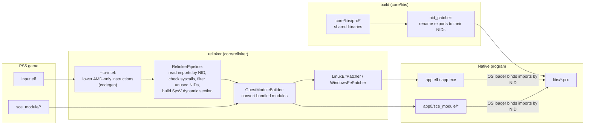
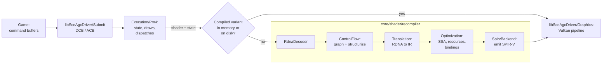

# Architecture

How a PS5 executable becomes a native Linux or Windows program. Nothing is emulated: the converted executable runs as a normal process and calls native implementations of the system libraries.

## Overview

- [`core/relinker/main.cpp`](../../core/relinker/main.cpp) runs the steps in this order. `--to-intel` is optional, see [USAGE.md](../user/USAGE.md).
- Each library in [`core/libs/prx`](../../core/libs/prx) builds as a shared library. After the build, `nid_patcher` ([`core/libs/nid`](../../core/libs/nid)) renames every export to its NID, computed from the function name. `APS5_EXPORT("<nid>", func)` sets the NID directly when the name is unknown.

## ELF import range contract

[`RelinkerPipeline::Relink`](../../core/relinker/relinker/src/pipeline/RelinkerPipeline.cpp) reads imports from the input image before either output patcher runs. Ordinary `DT_SYMTAB`, `DT_STRTAB` and relocation addresses are translated from virtual addresses; their `DT_OS_` variants are file offsets. Both tag families must obey the same input bounds.

`DT_SYMENT` must be 24, the ELF64 symbol stride. For each symbol-referencing relocation, this lookup consumes only the four-byte `st_name` field. It does not require the remaining 20 bytes: a readable `st_name` ending exactly at EOF passes import lookup. [`SysVDynamicSectionBuilder`](../../core/relinker/relinker/src/output/SysVDynamicSectionBuilder.cpp) constructs new output symbols from the resolved imports. Windows TLS analysis separately requires complete records in the declared symbol table through [`CodeInstructionCollector`](../../core/relinker/relinker/src/analysis/CodeInstructionCollector.cpp); it rejects this truncated record after import lookup. Bundled-module export parsing also consumes other symbol fields.

Before reading `st_name`, the symbol base and indexed field must fit the input image. A wrapped base-plus-index sum must be rejected even if it lands on readable bytes. The 32-bit symbol index times the 24-byte stride fits a 64-bit offset; adding the input-controlled base and adding a field length can overflow. Bounds must be established with available-byte comparisons or checked arithmetic before deriving a pointer. `st_name` must lie below `DT_STRSZ`, and its string must terminate within the validated dynamic string table.

`R_X86_64_RELATIVE` with symbol index zero bypasses symbol lookup. Missing or empty optional PLT metadata does not add symbol reads. Both passes over RELA entries use the same checked `relaEntryPos` calculation.

[`symbol_ranges`](../../core/relinker/relinker/tests/test_symbol_ranges.py) exercises both output formats through the CLI, with ordinary and OS symbol tags, main and PLT relocations, exact field boundaries, overflowing offsets, truncated fields and invalid names. Rejection during import lookup must return the controlled conversion status `2`, identify the invalid range and create neither an executable nor an import registry. Signals, exceptions terminating the process and unrelated diagnostics fail the regression. Valid controls check the output format and retained import name, relocation type and target. The four-byte EOF control must produce a Linux executable; Windows must preserve the import registry, then reject the incomplete symbol table during code analysis without creating an executable.

[`Mspace.cpp`](../../core/libs/tests/Mspace.cpp) retains the allocator resize regression: rejected ordinary and aligned requests near the maximum size preserve contents, usable size and allocation statistics, followed by successful resizing, freeing and reuse. Parser coverage does not establish game compatibility.

## Graphics

- [`Recompiler.cpp`](../../core/shader/recompiler/Recompiler.cpp) runs the stages in this order. With `ANYPS5_ENABLE_SPIRV_TOOLS`, the SPIR-V is also validated and optimized with SPIRV-Tools.
- `ShaderRecompiler::Recompile` keeps compiled variants in memory, and `ShaderDiskCache` stores them on disk so later runs reuse them.
