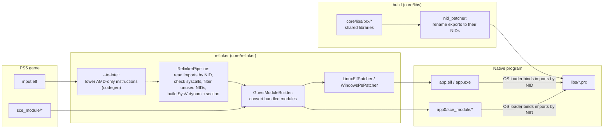
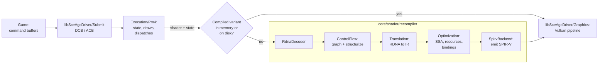

# Architecture

How a PS5 executable becomes a native Linux or Windows program. Nothing is emulated: the converted executable runs as a normal process and calls native implementations of the system libraries.

## Overview

- [`core/relinker/main.cpp`](../../core/relinker/main.cpp) runs the steps in this order. `--to-intel` is optional, see [USAGE.md](../user/USAGE.md).
- Each library in [`core/libs/prx`](../../core/libs/prx) builds as a shared library. After the build, `nid_patcher` ([`core/libs/nid`](../../core/libs/nid)) renames every export to its NID, computed from the function name. `APS5_EXPORT("<nid>", func)` sets the NID directly when the name is unknown.

## Graphics

- [`Recompiler.cpp`](../../core/shader/recompiler/Recompiler.cpp) runs the stages in this order. With `ANYPS5_ENABLE_SPIRV_TOOLS`, the SPIR-V is also validated and optimized with SPIRV-Tools.
- `ShaderRecompiler::Recompile` keeps compiled variants in memory, and `ShaderDiskCache` stores them on disk so later runs reuse them.

## Guest exceptions and wait recovery

[`Exception.cpp`](../../core/libs/prx/libkernel/System/src/Exception.cpp) registers handlers for signals 1, 4, 8, 10, 11 and 30. `sceKernelRaiseException` delivers only guest SIGUSR1 (30). Other raise values return `EINVAL`; a null or finished target returns `ESRCH`. A missing handler throws. These checks do not validate arbitrary non-null pointers or handles already released by join.

On Linux, delivery uses `pthread_kill` and a host SIGUSR1 handler with `SA_SIGINFO | SA_RESTART`. The guest handler runs on the interrupted thread's stack. General registers and the first 416 bytes of the FXSAVE state are written back; the kernel's XSAVE metadata is retained. On Windows, running threads receive a redirected context and alertable [`TimedWait`](../../core/libs/prx/libkernel/Time/TimedWait.cpp) waits receive an APC. A target interrupted inside `NtContinue`, `NtContinueEx` or winpthreads is resumed and retried, with a one-second retry limit. Non-alertable waits, including `APS5_COARSE_TIMED_WAITS`, can defer the handler until the host wait returns. Signal masks, console context equivalence and upper YMM preservation on Windows remain limited as recorded in [TechnicalDebt](TechnicalDebt.md).

The Windows path rechecks the guest thread's finished flag after `GetThreadContext` stops the target, before choosing APC delivery or redirecting it. The initial API check alone permits the thread to finish and unregister while suspension is pending; a handler calling `scePthreadSelf()` would then adopt a different guest handle. A target found finished after suspension is resumed and rejected with `ESRCH`. Failed suspension or context reads also consult guest completion: a terminating native thread can reject suspension before its Windows handle becomes signaled.

[`SyncOnAddress.cpp`](../../core/libs/prx/libkernel/SyncOnAddress/src/SyncOnAddress.cpp) compares the value and registers a waiter under one mutex. An explicit wake selects waiters at that exact address and sets their wake predicate. Exception delivery does not satisfy that predicate. A timed-out waiter removes its registration. Publishing a different value before calling wake also covers delivery racing wait entry: a thread that has not registered yet observes the changed value and returns without waiting.

[`GuestExceptionWaitRecovery.cpp`](../../core/libs/tests/GuestExceptionWaitRecovery.cpp) checks these observable properties in Release:

| Case | Required result |
| --- | --- |
| Wake requested before or after the held handler returns | One handler on the target, nonzero interrupted stack, successful wait and join |
| Delivery without a wake, with a wake at another address | `ETIMEDOUT`, no early success |
| Reuse of the same address after join | Matching value times out; changed value returns immediately |
| Raise racing thread exit | Accepted and observed deliveries counted separately; result is success or `ESRCH` |
| Finished, still joinable target | `ESRCH`, original thread result retained |

Atomic gates coordinate handler entry, release and thread exit without settling sleeps. Independent threads raise the exception and request the wake; releasing the handler does not depend on either call completing, because the interrupted code can still hold host locks. Address-wait cases deliberately include the wait-entry race: the public API provides no waiter-enrollment acknowledgement. They do not prove that every raise interrupts an already blocked host wait. The native lifecycle test observes `PthreadPrivate::_finished` before joining so the rejected target still owns a valid handle. On Windows, CTest explicitly selects the default alertable wait implementation; coarse waits have unresolved delivery failures and are excluded. Each test has a 20-second CTest timeout and five-second progress checks. No result establishes console signal-mask behavior, delivery completion during teardown, arbitrary stale-handle safety or title compatibility; #1668 remains open for those contracts and the other runtime workstreams.
